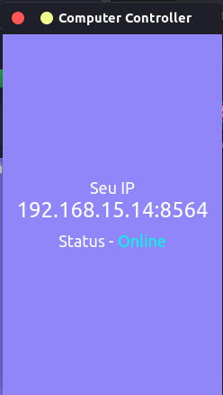
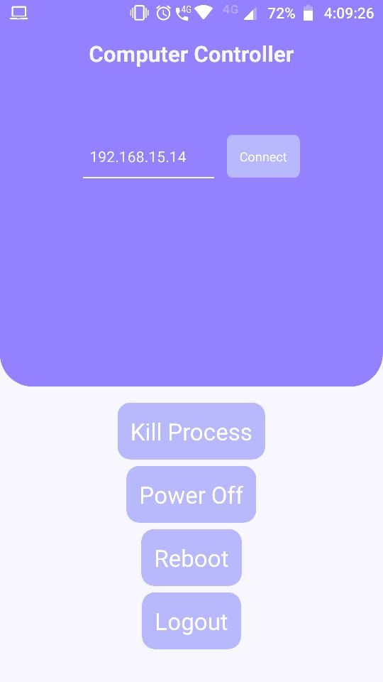

<h1 align="center">Welcome to Computer Controller 👋</h1>
<p>
  
  <a href="https://github.com/j4g3/computer-controller/blob/master/LICENSE" target="_blank">
    
  </a>

  <a href="https://twitter.com/j4g3dev" target="_blank">
    
  </a>
  
  <a>
    

  </a>

</p>

> Set of software to control computer remotely




## Usage

```
Download software for desktop and software for phone(Android)
```

## Installation

Linux

```console
sudo snap install computercontroller
```

Mac - <a href="https://github.com/j4g3/computer-controller/releases/download/v0.1.1/Computer.controller-0.1.1-mac.zip">Download</a>

## Author

👤 **João Guilherme**

- Twitter: [@j4g3dev](https://twitter.com/j4g3dev)
- Github: [@j4g3](https://github.com/j4g3)

## 🤝 Contributing

Contributions, issues and feature requests are welcome!<br />Feel free to check [issues page](https://github.com/j4g3/computer-controller/issues). You can also take a look at the [contributing guide](https://github.com/j4g3/computer-controller/graphs/contributors).

## Show your support

Give a ⭐️ if this project helped you!

## 📝 License

Copyright © 2020 [João Guilherme](https://github.com/j4g3).<br />
This project is [AGPL--3.0](https://github.com/j4g3/computer-controller/blob/master/LICENSE) licensed.

---

_This README was generated with ❤️ by [readme-md-generator](https://github.com/kefranabg/readme-md-generator)_
